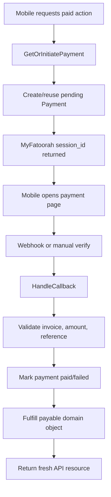
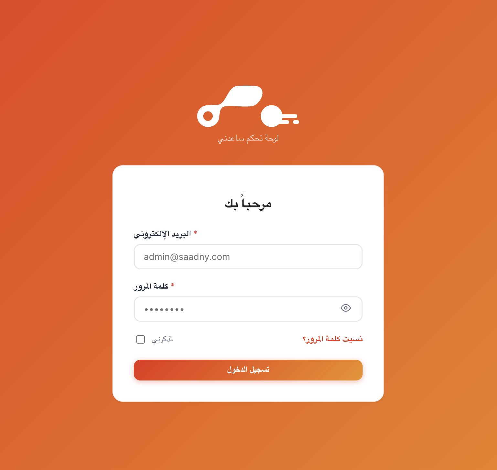
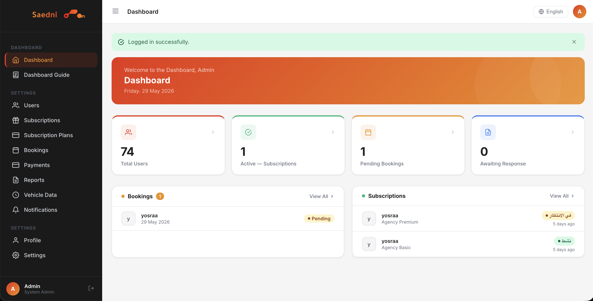
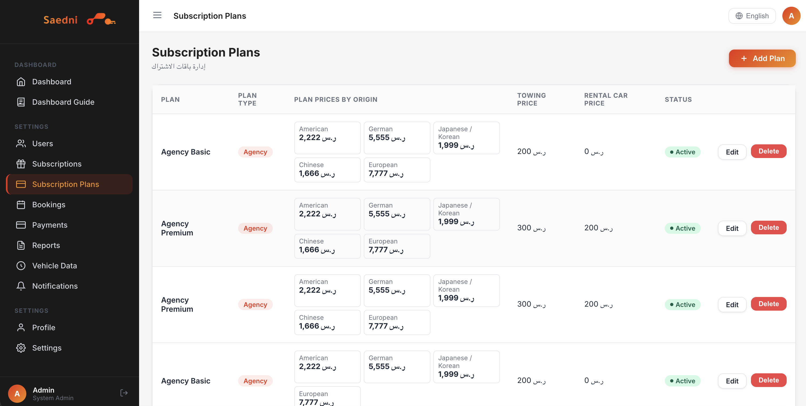
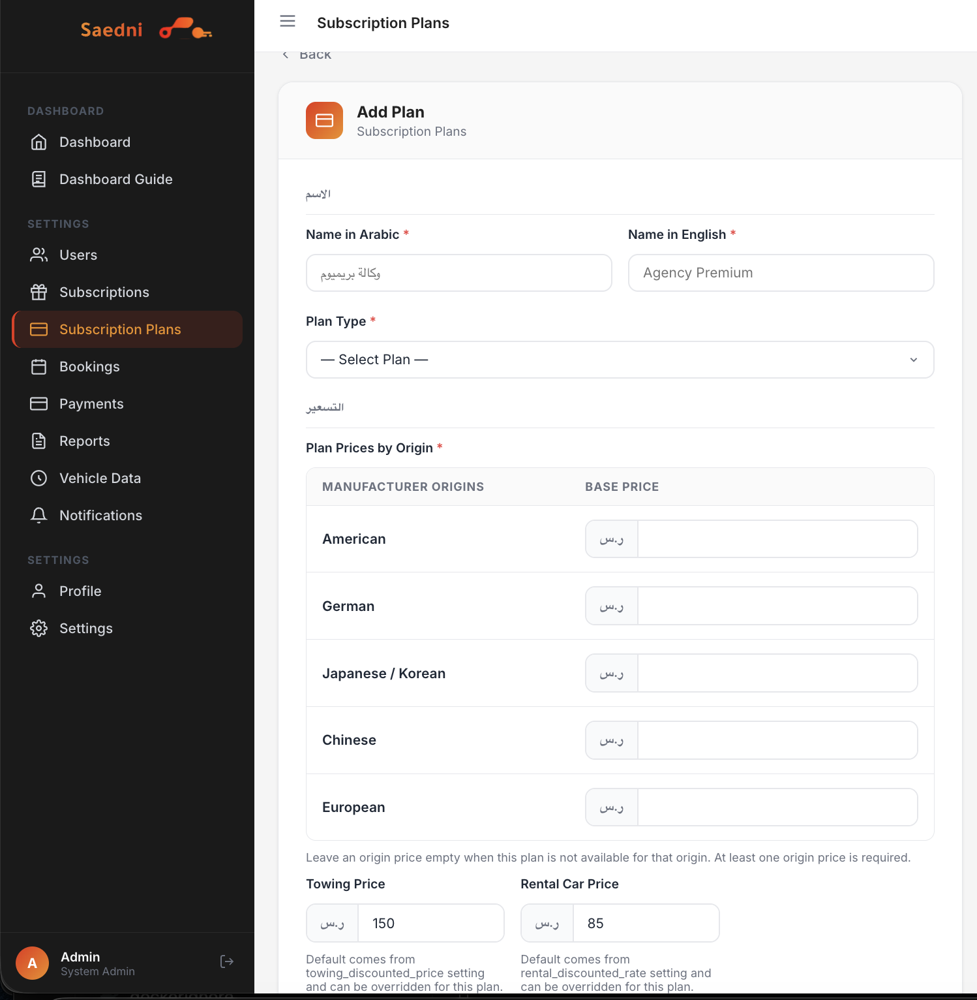
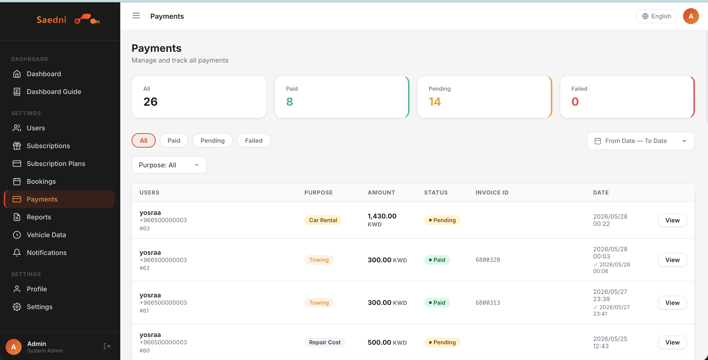
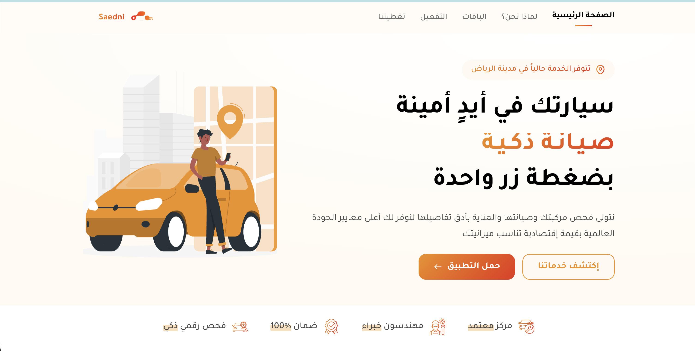

# Saedny Backend

Saedny is a bilingual automotive service platform built with Laravel. It powers a mobile app and an admin dashboard for vehicle subscriptions, inspections, towing, replacement car rentals, repair reports, payments, notifications, and OTP authentication.

The codebase is designed around production concerns: payment idempotency, webhook/manual payment reconciliation, per-vehicle subscriptions, clean API resources, explicit business actions, and test coverage for money-sensitive flows.

## Project Highlights

- Multi-vehicle user accounts with separate subscriptions per vehicle.
- Subscription plans priced by manufacturer origin instead of a single global plan price.
- MyFatoorah payment lifecycle for inspection fees, subscriptions, renewals, towing, replacement car rentals, and repair report costs.
- Safe payment verification through callbacks, webhooks, and manual mobile fallback verification.
- Booking workflow that hides unpaid service requests until payment is completed.
- Replacement car lifecycle: deliver to customer, receive back, calculate days and amount, collect payment, complete booking.
- Admin dashboard for subscriptions, bookings, reports, payments, settings, notifications, and plan pricing.
- Arabic and English localization with RTL/LTR support.
- OTP authentication with configurable SMS provider integration.
- Firebase push notifications for important user events.
- Idempotency middleware for retry-safe mobile requests.
- Feature tests covering critical payment and subscription scenarios.

## Tech Stack

| Area | Technology |
|---|---|
| Backend | Laravel 12, PHP 8.3 |
| API Auth | Laravel Sanctum |
| Admin UI | Blade, Vite, Tailwind-style design tokens |
| Database | MySQL in production, SQLite-supported tests |
| Payments | MyFatoorah SDK |
| Notifications | Firebase Cloud Messaging, Laravel notifications |
| SMS OTP | Configurable SMS driver, OSUS integration, log fallback |
| Roles | spatie/laravel-permission |
| Translations | spatie/laravel-translatable |
| Files | public storage for reports and media |
| Testing | Pest / PHPUnit |

## Architecture

The project uses a layered Laravel structure. Controllers stay thin, while business decisions live in Action classes and responses are normalized through API Resources.

```txt
app/
├── Actions/
│   ├── Auth/
│   ├── Booking/
│   ├── Payment/
│   ├── Rental/
│   ├── Report/
│   ├── Subscription/
│   └── Vehicle/
├── DTOs/
├── Enums/
├── Http/
│   ├── Controllers/
│   │   ├── Api/V1/
│   │   └── Web/
│   ├── Middleware/
│   ├── Requests/
│   └── Resources/
├── Models/
├── Services/
└── Support/
```

Key design choices:

- **Actions** contain business workflows such as `CreateBooking`, `HandleCallback`, `StartRental`, and `ReturnRental`.
- **Enums** make status transitions explicit for bookings, payments, subscriptions, reports, rentals, and activation types.
- **Resources** keep mobile API responses stable and frontend-friendly.
- **Middleware** handles JSON forcing, locale, admin access, and idempotency.
- **Services** integrate external systems like MyFatoorah, Firebase, SMS, files, and subscription pricing.

## Main Domains

### 1. Vehicles

Users can register multiple vehicles. Each vehicle includes brand, model, year, VIN, plate number, and manufacturer origin.

Manufacturer origin is important because subscription prices are calculated from `subscription_plan_origin_prices`, not from one global plan price.

### 2. Subscriptions

Each vehicle can have its own subscription. The subscription cycle supports:

- Immediate activation with inspection fee.
- Delayed activation with a 60-day waiting window.
- Inspection completion or rejection by admin.
- Subscription payment after inspection.
- Renewal flow.
- Cancellation and expiry jobs.

### 3. Bookings

Bookings can include towing, replacement car rental, or both. The API exposes `vehicle_id` so the mobile app can safely filter active requests per vehicle.

Unpaid service requests do not appear as active bookings until payment is completed.

### 4. Replacement Car Rental

The replacement car flow is admin-driven:

1. User requests replacement car.
2. Admin delivers the car to the customer.
3. Admin receives the car back.
4. System calculates cost from total days and daily rate.
5. If payment is required, mobile receives `payment_info`.
6. After payment verification, rental becomes `paid` and booking becomes `completed`.

### 5. Reports

Admin can create inspection or repair reports for bookings. Reports can include file/PDF URLs and repair amounts. If a report has a payment amount, the same payment lifecycle is used instead of a custom side flow.

### 6. Payments

Payments are centralized in the `payments` table and linked through polymorphic `payable_type/payable_id`.

Supported payment purposes:

- inspection fee
- subscription
- renewal
- booking towing
- rental
- repair cost

## Payment Flow

Saedny treats payments as a first-class domain, not a controller-only concern.



Important safeguards:

- Row-level locking while verifying payment.
- Amount mismatch detection.
- Invoice and customer reference validation.
- Idempotent fulfillment if webhook and manual verify arrive close together.
- Cache invalidation for stale payment sessions.
- A manual `POST /payment/{payment}/verify` fallback for mobile if webhook is delayed.

## API Overview

All protected mobile routes use Sanctum:

```http
Authorization: Bearer {token}
Accept: application/json
```

Selected routes:

```txt
POST   /api/v1/auth/otp/send
POST   /api/v1/auth/otp/verify

GET    /api/v1/vehicles
POST   /api/v1/vehicles
PUT    /api/v1/vehicles/{vehicle}

GET    /api/v1/subscription-plans?vehicle_id={id}
GET    /api/v1/subscriptions
POST   /api/v1/subscriptions
POST   /api/v1/subscriptions/{subscription}/retry-payment
POST   /api/v1/subscriptions/{subscription}/complete-payment

GET    /api/v1/bookings?vehicle_id={id}
POST   /api/v1/bookings
GET    /api/v1/bookings/{id}
POST   /api/v1/bookings/{id}/retry-towing-payment

GET    /api/v1/bookings/{id}/rental
POST   /api/v1/bookings/{id}/rental/start
POST   /api/v1/bookings/{id}/rental/return

POST   /api/v1/payment/{payment}/verify

GET    /api/v1/reports
GET    /api/v1/reports/{id}
POST   /api/v1/reports/{id}/respond
```

## API Response Example

`GET /api/v1/bookings?vehicle_id=59`

```json
{
  "data": [
    {
      "id": 108,
      "vehicle_id": 59,
      "user_subscription_id": 1,
      "status": {
        "value": "completed",
        "label": "مكتمل",
        "color": "success"
      },
      "towing_requested": false,
      "towing_paid": false,
      "rental_car_requested": true,
      "rental": {
        "id": 14,
        "booking_id": 108,
        "status": {
          "value": "paid",
          "label": "تم الدفع",
          "color": "success"
        },
        "daily_rate": "130.00",
        "started_at": "2026-05-17T00:00:00+00:00",
        "returned_at": "2026-05-28T00:22:00+00:00",
        "total_days": 11,
        "total_amount": "1430.00",
        "payment_info": null
      }
    }
  ]
}
```

## Screenshots

The screenshots below highlight the real admin and landing experiences that sit on top of the backend API.

> Before publishing, keep these images free of real customer names, phone numbers, invoice IDs, tokens, and production URLs.

### Admin Login

Secure admin entry point with Arabic RTL support and brand identity.



### Dashboard Overview

Operational dashboard with users, active subscriptions, pending bookings, reports, and recent activity.



### Subscription Plans

Plan management with manufacturer-origin pricing, towing price, rental car price, and activation status.



### Add Subscription Plan

Admin form for bilingual plan names, plan type, origin-based pricing, towing price, and replacement car price.



### Payments

Payment operations page with purpose filtering, paid/pending/failed states, invoice tracking, and payment review.



### Landing Page

Public Arabic landing page for the mobile service, showing the product positioning and brand experience.



## Code Snapshots

These snippets show the engineering style used in the project. They are copied from real project files.

### Atomic Payment Verification

`app/Actions/Payment/HandleCallback.php`

```php
/**
 * Verify payment with MyFatoorah and apply fulfillment atomically.
 * Safe to call multiple times (idempotent) and concurrently (row-locked).
 */
public function execute(string $paymentId, string $keyType = 'PaymentId', ?Payment $expectedPayment = null): Payment
{
    $status = $this->myfatoorah->getPaymentStatus($paymentId, $keyType);

    $result = DB::transaction(function () use ($status, $paymentId, $keyType, $expectedPayment) {
        $payment = Payment::whereKey($expectedPayment?->id)
            ->lockForUpdate()
            ->first();

        if ($payment->invoice_id && (string) $payment->invoice_id !== (string) $status['invoice_id']) {
            throw new RuntimeException('payment_invoice_mismatch');
        }

        if (!$this->amountsMatch((float) $payment->amount, $status['amount'])) {
            $payment->update([
                'status' => PaymentStatus::FAILED,
                'failure_reason' => 'amount_mismatch',
            ]);

            return ['payment' => $payment->fresh(), 'transitioned' => true, 'outcome' => 'failed'];
        }

        $payment->update([
            'status' => PaymentStatus::PAID,
            'paid_at' => now(),
        ]);

        $this->fulfill($payment->fresh());

        return ['payment' => $payment->fresh(), 'transitioned' => true, 'outcome' => 'paid'];
    });

    return $result['payment'];
}
```

Why it matters:

- Prevents race conditions between webhook and mobile verify.
- Rejects tampered amounts or mismatched invoices.
- Keeps domain fulfillment in one place.

### Booking Creation With Subscription Guardrails

`app/Actions/Booking/CreateBooking.php`

```php
public function execute(User $user, CreateBookingDTO $dto): Booking
{
    return DB::transaction(function () use ($user, $dto) {
        $this->checkCapacity->execute($dto->scheduledDate);

        $subscription = $user->subscriptions()
            ->where('vehicle_id', $dto->vehicleId)
            ->where('status', SubscriptionStatus::ACTIVE->value)
            ->latest()
            ->first();

        if (!$subscription) {
            throw ValidationException::withMessages([
                'subscription' => [__('messages.no_subscription')],
            ]);
        }

        if ($dto->towingRequested) {
            $pendingTowing = Booking::where('user_id', $user->id)
                ->where('towing_requested', true)
                ->where('towing_paid', false)
                ->where('towing_cost', '>', 0)
                ->whereIn('status', [BookingStatus::PENDING->value, BookingStatus::CONFIRMED->value])
                ->lockForUpdate()
                ->first();

            if ($pendingTowing) {
                throw new PendingTowingPaymentException($pendingTowing);
            }
        }

        return Booking::create([...]);
    });
}
```

Why it matters:

- A booking must belong to an active subscription for the same vehicle.
- Prevents duplicate unpaid towing requests.
- Uses database transactions for consistency.

### Mobile-Friendly Booking Resource

`app/Http/Resources/BookingResource.php`

```php
return [
    'id' => $this->id,
    'vehicle_id' => $this->subscription?->vehicle_id,
    'status' => [
        'value' => $this->status->value,
        'label' => $this->status->label(),
        'color' => $this->status->color(),
    ],
    'towing_requested' => $this->towing_requested,
    'towing_paid' => $this->towing_paid,
    'rental_car_requested' => $this->rental_car_requested,
    'rental' => $this->rental_car_requested
        ? $this->whenLoaded('rental', fn () => $this->rental ? new CarRentalResource($this->rental) : null)
        : null,
];
```

Why it matters:

- Mobile can filter bookings by vehicle.
- Status is always returned as value/label/color.
- Rental details are nested in the booking list when relevant.

### Rental Payment Completion

`app/Actions/Payment/HandleCallback.php`

```php
private function fulfillRental(CarRental $rental): void
{
    $rental->update([
        'status'  => RentalStatus::PAID,
        'paid_at' => now(),
    ]);

    $rental->booking?->update([
        'status'       => BookingStatus::COMPLETED,
        'completed_at' => now(),
    ]);
}
```

Why it matters:

- Paying the rental immediately completes the parent booking.
- The booking list returns fresh `completed/paid` state after manual verify.

### Idempotent Mobile Requests

`routes/api/v1.php`

```php
Route::post('subscriptions', [SubscriptionController::class, 'store'])
    ->middleware(['throttle:5,1', 'idempotent']);

Route::post('bookings', [BookingController::class, 'store'])
    ->middleware(['throttle:10,1', 'idempotent']);

Route::post('bookings/{id}/rental/return', [CarRentalController::class, 'returnCar'])
    ->middleware('idempotent');
```

Why it matters:

- Mobile retries do not create duplicate subscriptions, bookings, or payments.
- Network instability is handled at the API boundary.

## Testing

Critical flows are covered by feature tests:

```txt
tests/Feature/PaymentCyclesTest.php
tests/Feature/SubscriptionPlanOriginPricingTest.php
tests/Feature/DelayedSubscriptionActivationTest.php
tests/Feature/SubscriptionShowTest.php
tests/Feature/OtpSmsTest.php
```

Run the suite:

```bash
php artisan test
```

Run payment cycle tests:

```bash
php artisan test --filter=PaymentCyclesTest
```

Examples covered:

- Paid towing bookings.
- Duplicate unpaid towing prevention.
- Retry payment reuse.
- Subscription inspection fee flow.
- Subscription payment activation.
- Booking creation from paid towing intent.
- Admin rental return with manual days.
- Rental payment verification updates booking immediately.
- Booking list includes `vehicle_id`, rental object, and payment info.
- Report payment creation and PDF URL exposure.
- OTP SMS localization and driver behavior.

## Admin Dashboard

The Blade admin dashboard supports:

- Subscription plan management with origin-based prices.
- User and vehicle visibility.
- Subscription inspection approval/rejection/activation.
- Booking management.
- Replacement car delivery/return flow.
- Report creation, PDF/file handling, and repair payment requests.
- Payment status review.
- Settings for towing and rental pricing.
- Notifications and localized messages.

## Background Jobs and Commands

Operational commands handle scheduled state transitions:

```txt
php artisan subscriptions:activate-pending
php artisan subscriptions:expire
php artisan bookings:expire
php artisan bookings:remind-upcoming
php artisan payments:reconcile-pending
php artisan subscriptions:notify-near-expiry
```

These commands keep delayed subscriptions, booking expiry, reminders, and pending payments consistent without relying only on user traffic.

## Environment Variables

Do not commit real credentials. Use `.env` only.

Important groups:

```env
APP_URL=
DB_CONNECTION=
SANCTUM_STATEFUL_DOMAINS=

MYFATOORAH_TOKEN=
MYFATOORAH_IS_TEST=
MYFATOORAH_COUNTRY=
MYFATOORAH_CURRENCY=
MYFATOORAH_WEBHOOK_SECRET=

FIREBASE_CREDENTIALS=

SMS_DRIVER=
OSUS_SMS_BASE_URL=
OSUS_SMS_SEND_PATH=
OSUS_SMS_CLIENT_ID=
OSUS_SMS_CLIENT_SECRET=
OSUS_SMS_SENDER_NAME=
```

## Local Setup

```bash
composer install
cp .env.example .env
php artisan key:generate
php artisan migrate --seed
npm install
npm run build
php artisan serve
```

For development:

```bash
composer run dev
```

## Deployment Notes

Typical production update:

```bash
git pull origin main
composer install --no-dev --optimize-autoloader
php artisan migrate --force
php artisan optimize:clear
php artisan config:cache
php artisan route:cache
php artisan queue:restart
```

Report files should be stored under:

```txt
public/report-files
```

## What Reviewers Should Notice

- The project handles real payment edge cases: duplicate requests, delayed webhooks, manual verification, stale sessions, and amount mismatches.
- The API is designed for mobile UI needs: stable status objects, nested payment info, vehicle-scoped bookings, and localized labels.
- Business logic is separated from controllers into testable Action classes.
- The system uses enums and resources instead of scattered strings and ad-hoc JSON.
- Feature tests cover the highest-risk domain: payments and state transitions.
- Arabic/English support is built into user-facing responses and dashboard text.
